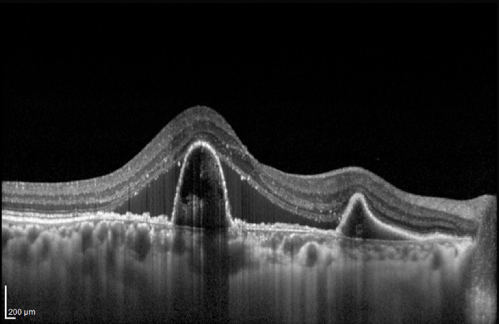
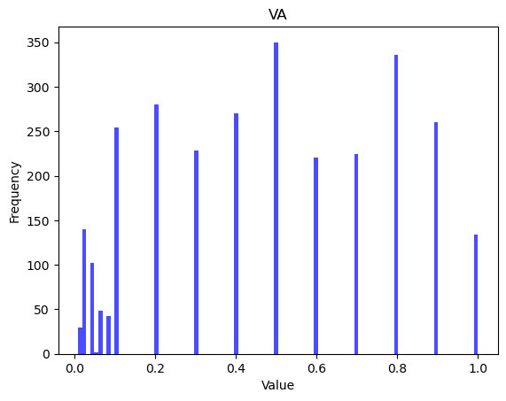
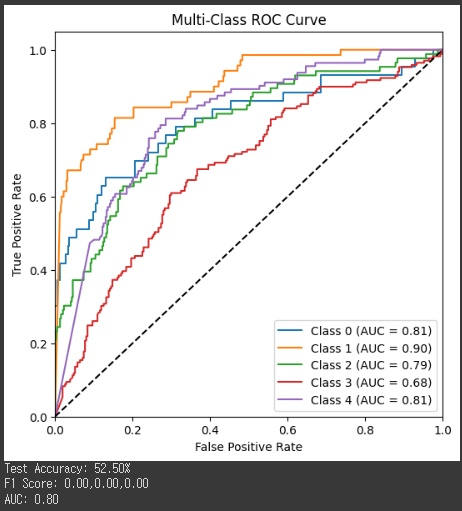
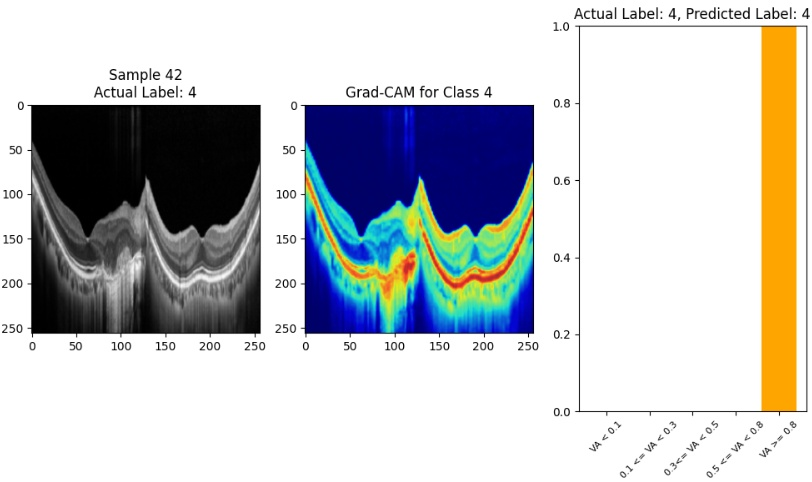

# OCT

# Data
10 OCT images for each of 240 patients.  
## Example and Distribution
   

# AUC of 5-Class Multi Classification
  
1. 5 class  
2. 1 : <0.1  
3. 2 : <=0.2   
4. 3 : <=0.4  
5. 4 : <=0.7  
6. 5 : >=0.8  

## Results
  
We used VGG16 model
